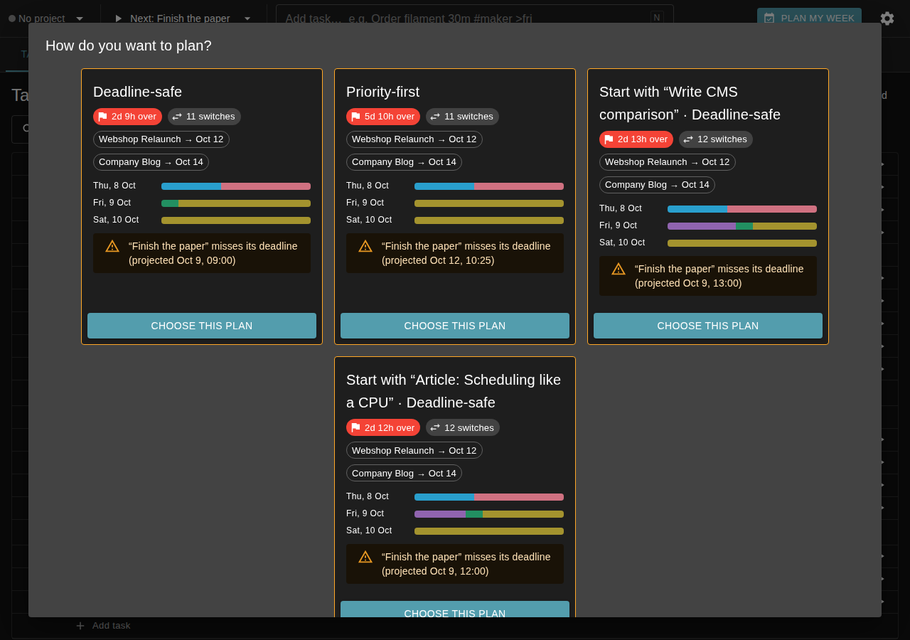
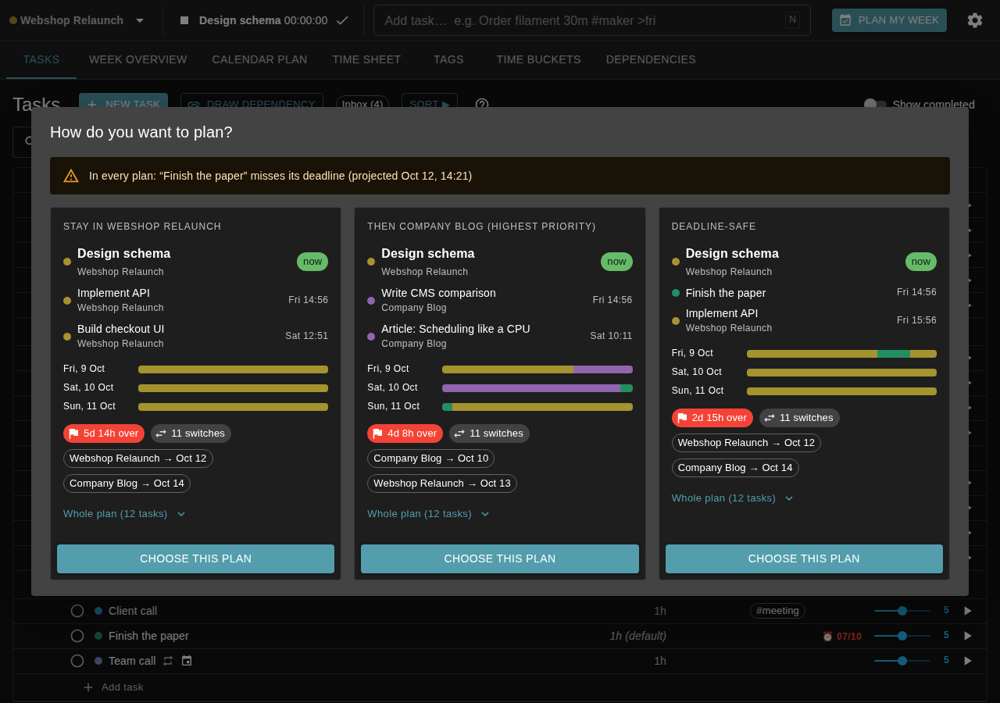

# The plan chooser ("Plan my week")

How Plina offers plans to choose from, and why the chooser looks the way it
does. Written before the redesign of October 2026; the last section is what
was built.

## 1. Usage scenarios

| # | Situation | What the user wants from "Plan my week" |
|---|-----------|------------------------------------------|
| S1 | **In the middle of work.** CAD (project T250) is being tracked; an urgent request arrives, or the estimate turned out too small. | The plan goes on with CAD — it is what is happening. The real question is what comes *after* it: stay in T250 (no context switch) or switch to the urgent thing. |
| S2 | **Starting the day / back from a break.** Nothing is tracked. | "What do I do next?" Options that start with *different projects*: the most important one, the one worked on yesterday (warm context), maybe the one with a deadline. The next two or three tasks of each decide it, not the strategy's name. |
| S3 | **Just completed a task.** Nothing tracked any more (completion no longer re-plans, README: Planning light). | Like S2, with the project just worked on being the obvious "continue" option. |
| S4 | **Weekly review on Monday.** | The whole week: do deadlines hold, when does each project finish? Still, the first decision is the one acted on first. |
| S5 | **On the phone between meetings.** | Read the next task of each option at a glance and tap one. No hovering, one column, no tiny strips as the only information. |
| S6 | **Overloaded week.** Every plan misses "Finish the paper". | Which option is least bad, and what does each cost? Warnings that are the same everywhere are noise in every card. |

## 2. Design and usability principles

- **P1 — Lead with the decision.** The next task(s) — name, project, when —
  are the primary content of an option; the strategy behind it is secondary.
- **P2 — Respect the flow.** Work that is running continues; leaving a
  project is a context switch and must be a visible, deliberate choice.
- **P3 — Real, recognisable choices.** Every option differs in what happens
  *next* (another project, another first task); its label says how it
  differs ("Highest priority", "Continue …", "Stay in …").
- **P4 — Progressive disclosure.** Next tasks always visible; the overview
  diagram at a glance; the full plan one click away, not shown by default.
- **P5 — Comparability.** The same kind of information sits at the same
  place in every option, so options can be compared by scanning across.
- **P6 — Touch first.** Nothing only on hover; works full screen in one
  column on a phone; big targets.
- **P7 — Show differences, quiet the common.** What is identical in every
  option (appointments, a deadline missed in all plans) is said once or
  drawn neutrally, not repeated.
- **P8 — Honest consequences.** Deadlines missed and finish dates are stated
  per option, in words.

## 3. Analysis of the current chooser

| Finding | Principle |
|---------|-----------|
| A card's title is the strategy ("Deadline-safe", "Start with “Write CMS comparison” · Deadline-safe"); which task comes next is only in a tooltip on a colour strip. | P1, P6 |
| A running task is not guaranteed to come first: the planner places tasks pinned by tracking by their start time and tag affinity, a task pinned yesterday can come before it, and its remaining time ignores the running session. | P2 |
| "Flow" sticks to a project only after it happens to pick one; it does not continue the running task's project on purpose. | P2 |
| "Deadline-safe" is strict earliest-deadline-first: a low-priority task with any deadline beats every high-priority task without one. | P8, user feedback |
| Alternatives come from dependency *branches* ("Start with …"), not from projects; the most important project and the recently worked on ones are not offered as such, and two options often start with the same task. | P3 |
| The mini timeline (liked) colours appointments like work; they are the same in every option and dominate the first day. | P7 |
| The same warning ("Finish the paper misses its deadline") is repeated in every card; the project-finish chips are often identical too. | P7 |
| Card heights differ, a fourth card wraps alone below; sections do not line up across cards. | P5 |
| No way to see the whole plan in the chooser. | P4 |

## 4. Ideas

**A — "What's next" cards.** Keep cards side by side, restructure each:
a short label saying how the option differs (overline), then **Next** — the
first three tasks with project and start time (the running one marked
"now") —, the mini timeline with appointments drawn neutral, per-option
consequences (slack, switches, only the warnings particular to the option),
**Whole plan (n)** as an expandable list grouped by day, and the choose
button. Warnings common to all options are said once above the cards. One
column on phones.

**B — Comparison table.** Options as columns, rows as "Now", "Next",
"Then", days of the week, finish dates, warnings; a "Choose" button per
column.

**C — Decision list (accordion).** One row per option, reading like a
sentence: "Next: CAD (T250) · then Firmware, Test prints". A row expands to
the timeline, the whole plan and the choose button; the first is expanded.

**D — Two steps.** First pick what to do next (big tiles, one per project
offered); then pick how to plan the rest (Deadline-safe / Flow /
Priority-first).

## 5. Judgement

| | P1 | P2 | P3 | P4 | P5 | P6 | P7 | P8 | Notes |
|---|---|---|---|---|---|---|---|---|---|
| **A** cards | ✓ | ✓ | ✓ | ✓ | ✓ (fixed sections) | ✓ (stacks) | ✓ | ✓ | Keeps the liked diagram; smallest change for users who know the chooser. |
| **B** table | ✓ | ✓ | ✓ | ~ (long tables) | ✓✓ | ✗ (columns do not fit a phone) | ✓ | ✓ | The diagram has no place; the whole plan in a table gets very long. |
| **C** accordion | ✓ | ✓ | ✓ | ✓ | ~ (only one option open to compare) | ✓✓ | ✓ | ~ (consequences hidden until opened) | Hides the diagram and the consequences of the closed options. |
| **D** two steps | ✓✓ | ✓ | ✓ | ✓ | ~ | ✓ | ✓ | ✗ (consequences of the combination only at the end) | Two decisions where the plan is one; doubles the clicks; does not fit plans generated as a whole. |

**Decision: A.** It satisfies every principle, keeps the diagram that works,
and matches the request literally: the next tasks always shown, the rest of
the plan an expandable list. B is the best for comparing on a big screen but
fails on phones; C and D hide consequences behind extra clicks.

## 6. What was built

Planner (backend):

- **A running task comes first** in every plan and in "Re-plan": it is
  placed from now on before anything else, in any time bucket, with the
  running session counted as time spent. Starting to track no longer pins a
  task (that pin used to drag stopped tasks to the front of every later
  plan); the plan knows the running task from its session.
- **Flow** continues the project of the running task (or of the first task)
  before switching: its tasks are ranked first, with project stickiness.
- **Deadline-safe** is as priority-driven as possible without missing more
  deadlines (or missing them by more) than strict earliest-deadline-first.
- **Options by project.** Besides the presets, the planner offers a plan
  focused on the **highest-priority project** and on the projects **worked
  on most recently** (tracked time, newest first), then the others by
  priority. The selection prefers options whose next task belongs to a
  different project; where two options plan the same, the one naming a
  project stays. With a running task the options read "Stay in …",
  "Then … (highest priority)", "Then back to …".

Chooser (frontend): idea A — the card as described in §4, starting from
now (what is over by the time the options were made is left out of the
timeline and the whole plan). See also the README.

